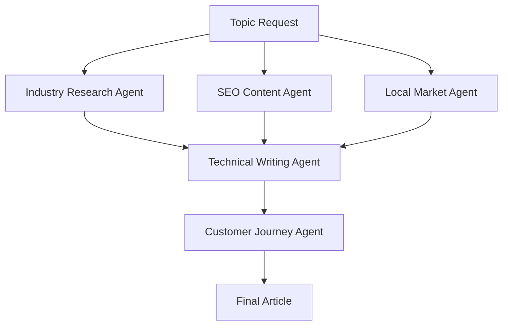

# Article Research Agents

This directory contains specialized research agents designed to streamline the article creation process for the ICA website. Each agent has specific expertise and capabilities tailored to different aspects of content research and development.

## Agent Structure

Each agent is defined by:
- **Role Definition**: Clear scope and responsibilities
- **Research Capabilities**: Specific tools and methodologies
- **Output Formats**: Standardized deliverables
- **Integration Points**: How it connects with other agents

## Available Agents

### 1. Industry Research Agent (`industry-research.md`)
- Arizona insulation regulations and codes
- Market trends and competitor analysis
- Technical specifications and standards
- Energy efficiency requirements

### 2. SEO Content Agent (`seo-content.md`)
- Keyword research and optimization
- Content structure and formatting
- Meta descriptions and schema markup
- Local SEO for Arizona markets

### 3. Technical Writing Agent (`technical-writing.md`)
- Service descriptions and specifications
- How-to guides and tutorials
- Safety protocols and best practices
- Installation procedures

### 4. Customer Journey Agent (`customer-journey.md`)
- Pain point identification
- Solution mapping
- Conversion optimization
- Lead generation strategies

### 5. Local Market Agent (`local-market.md`)
- Arizona climate considerations
- Regional building codes
- Local contractor landscape
- Seasonal demand patterns

## Workflow Integration

## Usage Guidelines

1. **Sequential Processing**: Start with industry and SEO research
2. **Cross-Reference**: Validate findings across multiple agents
3. **Synthesis**: Combine insights into cohesive content strategy
4. **Quality Assurance**: Ensure accuracy and relevance

## Output Standards

All agents produce:
- Executive summaries
- Key findings with data support
- Actionable recommendations
- Source citations
- Integration suggestions

## Maintenance

- Regular updates to reflect industry changes
- Quarterly reviews of agent effectiveness
- Continuous improvement based on content performance
- Integration with new tools and data sources